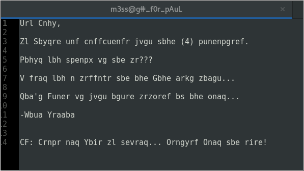
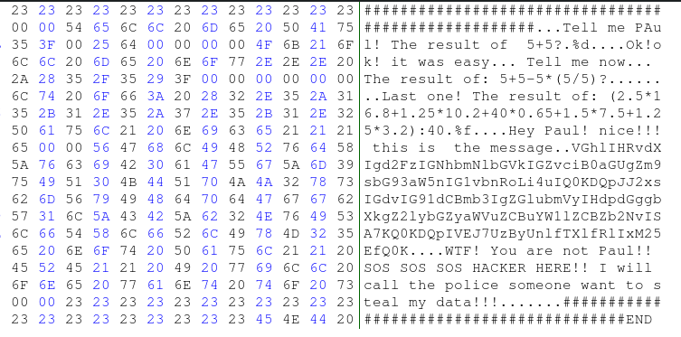
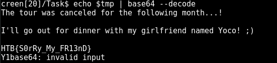

# HackTheBox: Beatles

| | |
| ------------- |:-------------:|
|  **Category** | Stego        |
| **Author**      | Arrexel    |
| **Points**       | 30           |
| **Difuculty**  | Easy        |
| **Solved by** | ZeroVash		|


**Description**: 

	>  'John Lennon send a secret message to Paul McCartney about the next music tour of Beatles... Could you find the message and sumbit the flag? 

***

**Write up**:

Well, let start this interesting chalenge. 

So we got two files, output of 'file':

>m3ss@g#_f0r_pAuL: ASCII text

>BAND.zip: Zip archive data, at least v2.0 to extract

Hm... First let try to open zip....

Well it ask for a password and we dont have it (if it ever stoped us :) ). 

We probably will need to brute force zip. But let look at our text file first...



We see the cyphertext. It looks like the length of words is the same as in original text. So the first that came in to mind, that it is Ceasar shifting algorithm. 

After trying all posible shift; I conclude, that it is not a Ceasar shifting algorithm. 

Hm... if it is not a Ceasar algorithm it might be a monoaplphabetic substitution algorithm, because I can definetly see words in this text file.

Few minutes later.....

I found a key:

```
	abcdefghijklmnopqrstuvwxyz 
	nopqrstuvwxyzabcmefghijkld 
```


Well, it just tell us excatly what I thought right in the begining. We don't even needed this text file. We know what to do... 

Since it should be very easy chalenge and it only 4 letter password, let start with some small dictionary.

```bash
	$ fcrackzip -u -D -v -p  sources/Dictionaries/Kali/rockyou.txt HTB_Stego/Beatles\[30\]/BAND.zip 
```

>HTB_Stego/Beatles\[30\]/BAND.zip 
>found file 'BAND.JPG', (size cp/uc  56772/ 77643, flags 9, chk 71f5)

>PASSWORD FOUND!!!!: pw == pass

Common guys, atleast create a longer password. 


....

After unpacking our zip file, I get the jpg image.

>BAND.JPG: JPEG image data, JFIF standard 1.01, aspect ratio, density 1x1, segment length 16, baseline, precision 8, 1600x1067, frames 3

Strings output gave us something interesting:

>VkhKNUlFaGhjbVJsY2lFPQ==

It is a base64 encoding!!!
```bash
	$ tmp=VkhKNUlFaGhjbVJsY2lFPQ==
	$ echo $tmp | base64 --decode
```

Well it was encoded twice so after repeating same step we get:

>Try Harder!


Ok... ok... let continue our FIGHT....

Stegsolve - nothing

Binwalk - nothing

After finding myself in the midle of hex editor analizing this image and our previous zip file, I realize that I might missing something obvious....

Steghide!!! What if we know the password?!

```bash 
	$ steghide extract -sf BAND.JPG
```
Password... Well... It can be anything:

~Try Harder!

TRYHARDER!

tryharder!

try harder!

TRY HARDER!

band

BAND

Band

Paul

...
	~
	
Nothing work, after couple cup of coffee I realize that the image state "the beatles". Let try:

~The Beatles

Beatles

BEATLES

THE BEATLES

THEBEATLES ~

==THEBEATLES==!!!!

It finaly cracked and gave us another file - "testabeatle.out".

FINALLY, some progress. 

>testabeatle.out: ELF 64-bit LSB shared object, x86-64, version 1 (SYSV), dynamically linked, interpreter /lib64/ld-linux-x86-64.so.2, for GNU/Linux 2.6.32, BuildID[sha1]=ca68ea305ff7d393662ef8ce4e5eed0b478c8b4e, not stripped

Wow... There are so many ways to analize it. 

Well let try to open this file in easy way first, using hex editor. 

Few lines later:



Hahah looks like we supouse to go another way :) 

We should run it and answer all those questions in order to recieve the message. Or check the overflow :)

Hahaha can even see those if statments. 

But, since he store all those text in strings constants we can see them in hex editor :) We make it even easier.

So here we have a string:

>VGhlIHRvdXIgd2FzIGNhbmNlbGVkIGZvciB0aGUgZm9sbG93aW5nIG1vbnRoLi4uIQ0KDQpJJ2xsIGdvIG91dCBmb3IgZGlubmVyIHdpdGggbXkgZ2lybGZyaWVuZCBuYW1lZCBZb2NvISA7KQ0KDQpIVEJ7UzByUnlfTXlfRlIxM25EfQ0KWTF

Let check if it is a base64 encoded string:



Now we can enjoy the flag.
	
***

Flag:
	
	```HTB{S0rRy_My_FR13nD}```