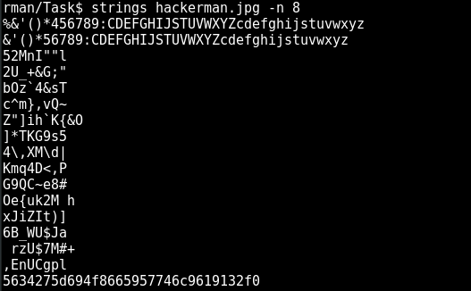

# HackTheBox: Hackerman

| | |
| ------------- |:-------------:|
|  **Category** | Stego        |
| **Author**      | SirenCeol    |
| **Points**       | 30           |
| **Difuculty**  | Easy        |
| **Solved by** | ZeroVash		|


**Description**: 

	>  'There should be something hidden inside this photo... Can you find out? 


***

**Write up**:

Well, according to points, should be another simple task. 

We have jpg picture. 

```bash
	$ file hackerman.jpg
```

>hackerman.jpg: JPEG image data, JFIF standard 1.01, aspect ratio, density 1x1, segment length 16, baseline, precision 8, 960x540, frames 3

Well, let continue our investigation by a standard procedure. Let run strings:

```bash
	$ strings hackerman.jpg -n 8
```



Well, first lines look just an array of all simbols. Then we have a lot of garbage.... And the last string stands out from all those garbage.... Not sure if it is anything, but let investigate.

So, we have a line:
	
	5634275d694f8665957746c9619132f0
	 
Hm... A string of numbers and letters.... Looks like hex numbers... it doesn't look like a base64.... BUT I will still check it.

```bash
	$ tmp=5634275d694f8665957746c9619132f0
	$ echo $tmp | base64 --decode
```
And we get some garbage:
>���۾]����������=�_u�g�s

Expected result, but I should try it... So, we have 32 letters, which is kind of common for md5  hash.

After finding some online md5 decoder. We found the original text:

> almost

Trolling?! hm... Definetly not a flag, :( 
But let think, may be it is a key or something.... Key... Wait a second we have a very interesting tool, called a steghide. It is very cool, but to extract staff from images we need a passphrase. May be, that 'almost' is a key? Let try out...

```bash
	$ steghide extract -sf hackerman.jpg
```
	
We typed our possible password... And ... magic .... it gave us txt file "hackerman.txt" .
	
Inside we have the following line:

	SFRCezN2MWxfYzBycH0=

Ok, it definetly looks like a base64. Let try to decode it.
	
```bash
	$ tmp=SFRCezN2MWxfYzBycH0=
	$ echo $tmp | base64 --decode
```

And it prints out:

>	HTB{3v1l_c0rp}
	
Here we go... Flag is found....
	
***

Flag:
	
	```HTB{3v1l_c0rp}```