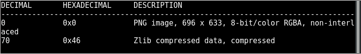
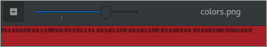
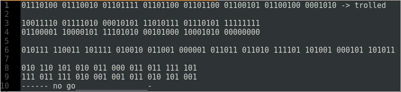

#HackTheBox: Hidden in Colors 
| | |
| ------------- |:-------------:|
|  **Category** | Stego        |
| **Author**      | SirenCeol   |
| **Points**       | 70           |
| **Difuculty**  | Medium*        |
| **Solved by** | ZeroVash		|

**Description**: 
> We intercepted this weird image coming from a person of interest, can you figure it out because we sure can't.
What we overheard is "the last two digits are of great importance".
***
**Write up**:
Very interesting stego task. One of the basic one, but made me sweat a little, since I first time saw it.

We have a one png file with 6 squares on it.
So first let check the file:
```bash
	$ file colors.png
```

> colors.png: PNG image data, 696 x 633, 8-bit/color RGBA, non-interlaced

So it is a png file.... Continue with investigation...
```bash 
	$ strings colors.png -n 6
Nothing interesting.... 
	$ strings colors.png -n 4
Nothing interesting....
```
Let see may be there are some hidden files inside the file.


zlib... it is one of the file that always come out of any png file.... But to make sure I check it as well.... And Nothing....

ok... Time to take a look closely to the picture.
First what we see is a binary string at the top corner:




> 01110100 01110010 01101111 01101100 01101100 01100101 01100100 0001010

Binary code. Divided by octet. One letter of UTF-8 is 8 bit. 
Using online tool we convert our binary string to:
> Trolled 

Ha! He got me there.... Or did he, lets try to play with this string a little:


After some time I see it is going nowhere. 

Lets run stegsolve.jar, to check this image under filters and its color channels. 
Nothing.... 
May be there something hidden with steghide?!
Let try steghide with password ***trolled***, ***Trolled***, etc
NOTHING....
Well, let think about what we have:
We have an image with 6 different colors, and binary string to nowhere.
6 different colors?!
Channels are clear....
Let see the color code of those colors:

| | |
|:--------:|:----------:|:----------:|
| 9f2624 |  247c33  | d42b63 |
| 5f5f30  | 0cef21  | 110731 |

What next?!  Wait in Description it had been said
> "the last two digits are of great importance".

Well, lets take last digits from each color from left to right, from up to bottom (if not working we will try other orders. It is just 720 possibilities XD )
	``24 33 63 30 21 31``
As a decimal numbers they don't tell me a lot, but what if they are hex numbers?! 
```\x24\x33\x63\x30\x21\x31```

Let translate them into letters:

```bash
echo -e "\x24\x33\x63\x30\x21\x31"
```
> $3c!1

Looks like a flag, let try it out, if not, we still have 619 to brute force :) .
***
Flag:
	```HTB{$3c!1}```

 