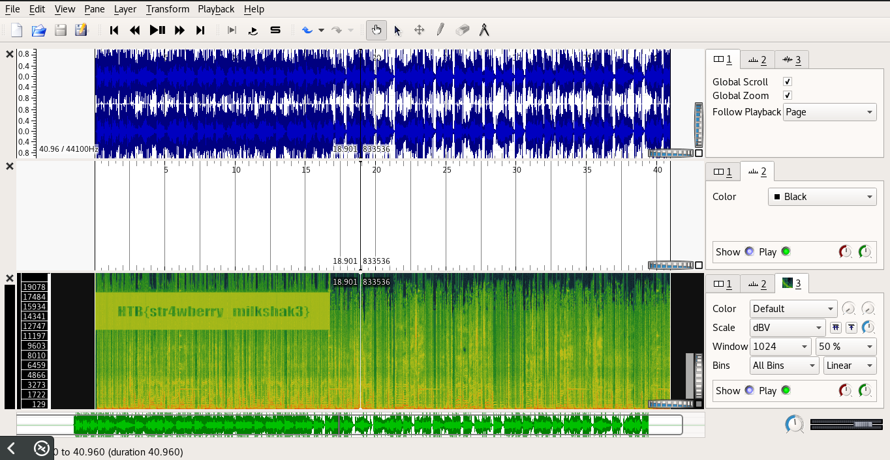

#HackTheBox: Milkshake 
| | |
| ------------- |:-------------:|
|  **Category** | Stego        |
| **Author**      | Arrexel    |
| **Points**       | 10           |
| **Difuculty**  | Easy        |
| **Solved by** | ZeroVash		|

**Description**: 
> Can you bring all the boys to the yard? 
***
**Write up**:

Very basic stego challenge.
We have a Milkshake.mp3 file. 
First, let check if the file is actually a mp3.
```bash
	$ file Milkshake.mp3
``` 
We get the following:

> Milkshake.mp3: Audio file with ID3 version 2.4.0, extended header, contains: MPEG ADTS, layer III, v1, 128 kbps, 44.1 kHz, JntStereo

Ok we actually have an audio file. Nothing suspicios in it, yet.
Next check strings for any information in the file:

```bash
	$ strings Milkshake.mp3 -n 8
```

Nothing....

Since it is an audio file let check it with SonicVisualizer.
Let add some spectrograms as well to get as much as posible.
	```Pane->Add Spectrogram-> All Cahnnels Mixed```


Look, what is that?! Looks like a flag.
***
Flag:
	```HTB{str4wberry milkshak3}```