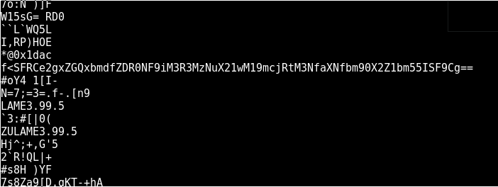

# HackTheBox: Raining Blood

| | |
| ------------- |:-------------:|
|  **Category** | Stego        |
| **Author**      | ch4p    |
| **Points**       | 40           |
| **Difuculty**  | Easy        |
| **Solved by** | ZeroVash		|


**Description**: 

	>  Can you find the hidden message? 

***

**Write up**:

This is very easy stego challenge. 

We have an mp3 file. Before we start to dig in, let check the file to see what we are working with.

```bash
	$ file RainingBlood.mp3
```

>RainingBlood.mp3: Audio file with ID3 version 2.3.0, contains: MPEG ADTS, layer III, v1, 320 kbps, 44.1 kHz, JntStereo


So it is an audio file. But before jumping to SonicVisualizer lets check its strings.

```bash
	$ strings RainingBlood.mp3 -n 6
```

Wait.... what is that?... 

```bash
	$strings RainingBlood.mp3 -n 8
```



Looks like a base64 string.

Let decode it.

```bash
	$ tmp=SFRCe2gxZGQxbmdfZDR0NF9iM3R3MzNuX21wM19mcjRtM3NfaXNfbm90X2Z1bm55ISF9Cg==
	$ echo $tmp | base64 --decode 
```

>HTB{h1dd1ng_d4t4_b3tw33n_mp3_fr4m3s_is_not_funny!!}

Looks like flag, very easy chalenge.

***

Flag:
	
	```HTB{h1dd1ng_d4t4_b3tw33n_mp3_fr4m3s_is_not_funny!!}```