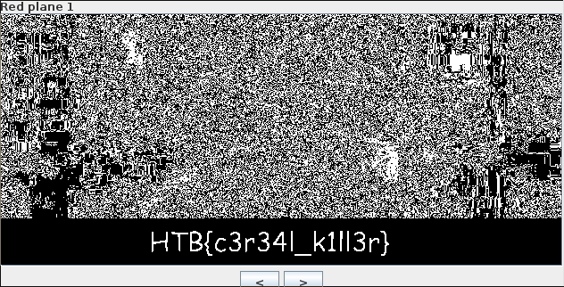
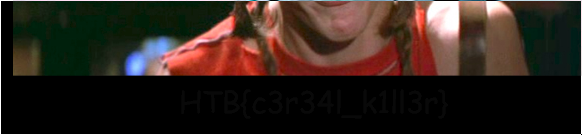

# HackTheBox: Widescreen

| | |
| ------------- |:-------------:|
|  **Category** | Stego        |
| **Author**      | Arrexel    |
| **Points**       | 20           |
| **Difuculty**  | Easy        |
| **Solved by** | ZeroVash		|


**Description**: 

	>  'Someone has leaked pictures of our unreleased movie. Can you help identify him? 


***

**Write up**:

This is very easy stego challenge. 

We have png picture. So let check if it is a png first.

```bash
	$ file widescreen.png
```

>widescreen.png: PNG image data, 628 x 281, 8-bit/color RGB, non-interlaced

So what about strings?

```bash
	$ strings widescreen.png -n 6
```
Nothing, interested, well the binwalk is also didn't say much. Well, let check our image color channels and under different filters.

Wait... What is that under Red 1 pannel?!



This is a flag, very easy chalenge.

Note:
	
>	Interesting but different programs open and display the png files differently. If the task open with debian lightweight image viewer which uses imlib2, we could see the flag without running original image through different color planes.



	
	
***

Flag:
	
	```HTB{c3r34l_k1ll3r}```